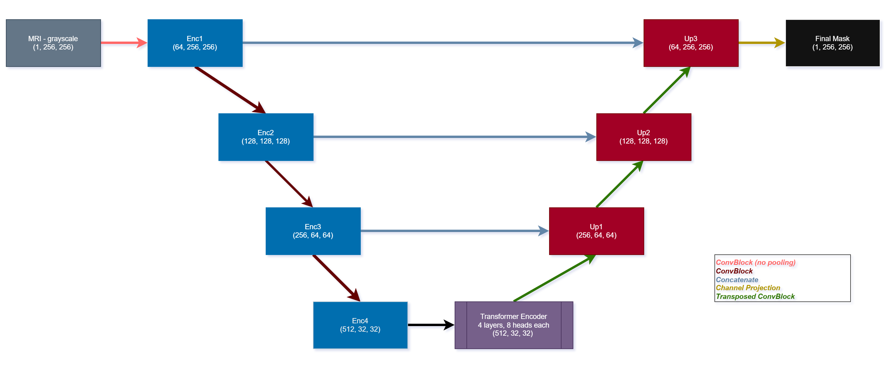

# TransUNet - Brain MRI Tumor Segmentator

This project focuses on automated tumor segmentation in MRI brain scans using deep learning. Manual segmentation is time consuming and prone to variability, motivating the need for reliable automated solutions. The project aims to improve consistency and efficiency in medical image analysis, by reducing doctors workload and provide assistance in tumor detection.

### Architecture
The project applies a hybrid U-Net and Transformer architecture to combine local feature extraction with global contextual understanding. The model follows a U-Net structure with a convolutional encoder, a Transformer-based bottleneck, and a decoder for precise segmentation.

#### Encoder (CNN): 
Uses standard convolutional layers to extract local features (textures, edges) and progressively reduce spatial resolution.

#### Transformer Bottleneck:
Replaces the traditional convolutional bottleneck. It flattens feature maps into patches and applies self attention. This allows the model to capture global context and understand the relationship between distant pixels, which is essential for identifying the full extent of larger tumors.

#### Decoder (Transposed Conv):
Upsamples the features using `nn.ConvTranspose2d` to restore spatial resolution. It uses residual connections to bring high-resolution local details from the encoder back into the mask generation process.

#### Activations
- **ReLU:** used in all convolutional blocks for non-linearity.
- **GELU:** used within the Transformer encoder to provide smooth non-linear activation suited for attention.
- **Sigmoid:** applied to the final output to convert the model’s predictions into a binary tumor segmentation mask.

### Data Collection/Preparation
We used the custom PyTorch dataset class - the MRIDataset - to load and preprocess MRI images together with their ground-truth images. To do it, we created an array called ‘samples’ and the pairs in it are stored as [MRI Scan, Ground Truth]. Only image–mask pairs for which both files exist, are included. 
All images and masks are resized to a fixed resolution of 256x256 pixels to ensure consistent input dimensions for the neural network. MRI images are resized and converted to tensors, while masks are resized using nearest-neighbor interpolation to preserve discrete label values and avoid the introduction of fake pixels that did not exist in the original image, created by the resizing process. Both images and masks are converted to grayscale, because there is no physical meaning for the color channel on this task. We want to get rid of redundant information to get better training time and less memory usage.

### Training and Evaluation
We did not immediately train on the full dataset. Instead, we began with a small pilot subset of 20 patients to observe the model’s behavior. During this phase, we focused on tuning two main axes: the loss function and the learning rate.
#### Loss Function:
Initially, the loss was set to be: $\mathcal{L} = 0.5 \cdot \mathcal{dice} + 0.5 \cdot \mathcal{BCE}$. however, this setup performed poorly, the model consistently produced noisy, fragmented binary masks that looked like scattered "islands" rather than coherent tumor regions. To fix this, we shifted the focus and gave much more weight to the Dice score:

$$
\mathcal{L} = 0.8 \cdot \mathcal{L}_{Dice} + 0.2 \cdot \mathcal{L}_{BCE}
$$

By prioritizing the Dice loss, we forced the model to care way more about the actual overlap of the tumor mask. The results improved almost immediately, producing much sharper and more accurate predictions.

#### Learning Rate:
Initially, we trained the model using a fixed learning rate. We then used a learning rate scheduler (ReduceLROnPlateau) to monitor the average validation Dice score, automatically reducing the learning rate when performance plateaued, which enabled finer weight updates and better convergence.

training performance on: `brain_tumor_model_v2`

### Analysis
#### Computational Challenge
Since our architecture is not a standard U-Net and includes an attention-based Transformer block, training was significantly more computationally demanding.
Initially, we used only three encoder blocks, reducing the feature map resolution to **64 × 64**. These large feature maps created a severe bottleneck at the Transformer stage, exhausting available VRAM and eventually causing system crashes.
To address this, we added a fourth encoder block (`enc4`), reducing the feature map resolution to **32 × 32**, which fit within our VRAM constraints (see the architecture diagram for clarity).

#### Results
We successfully trained a robust model (**`brain_tumor_model_v2`**), achieving an average Dice score of **86%+** on the validation set. The predictions are highly coherent and stable across the majority of inputs.
We recommend reviewing [`models/brain_tumor_model_v2/samples`](models/brain_tumor_model_v2/samples) to see the results or running [`evaluation.ipynb`](evaluation.ipynb) for evaluation.

